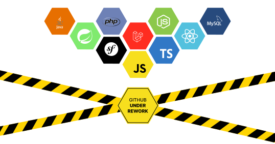

<!--  -->

## About

i learned 2 years at Epitech and i decided to continue as a web developer at ESGI in alternance.

I love sport, music and so much more ! 

## Links
  [Portfolio](https://fierensdev.github.io/) -> https://fierensdev.github.io/portfolio/
* [Github](https://github.com/FierensDev) -> https://github.com/FierensDev
* [LinkedIn](https://www.linkedin.com/in/fierensdenis/) -> https://www.linkedin.com/in/fierensdenis/
* [Instagram](https://www.instagram.com/d.fierens_/) -> https://www.instagram.com/d.fierens_/

<!-- - 📫 How to reach me: denis.fierens@epitech.eu -->
<!-- 
 -->

 <a href="https://lien">https://lien</a>

